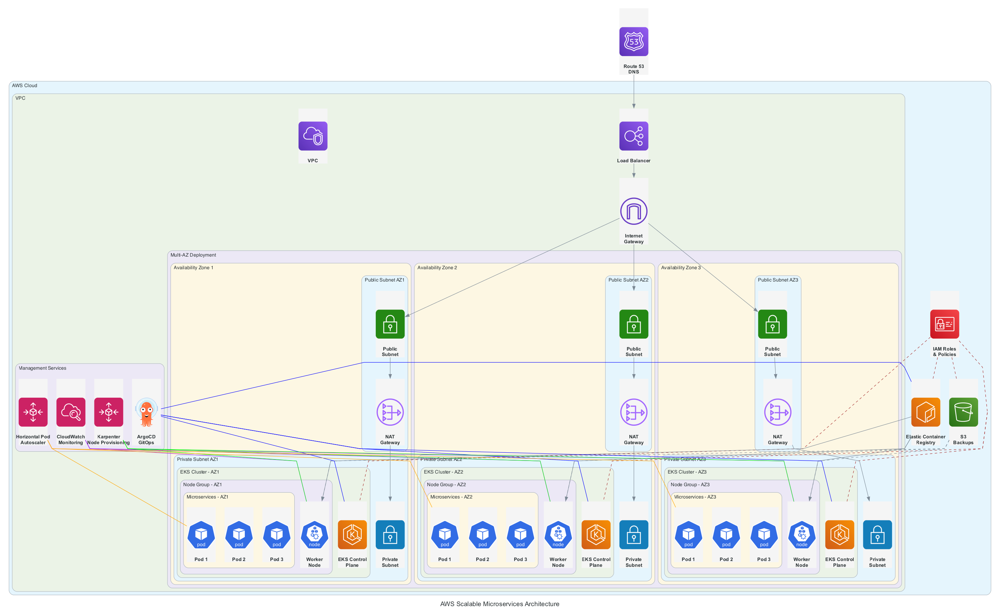

# Scalable Microservices Architecture on AWS

## Requirements

The requirement is to choose a cloud provider and design a scalable architecture for a microservices-based application with the following considerations:
- High availability
- Fault tolerance
- Cost optimization

## Architecture Overview

This document outlines a scalable, highly available, and fault-tolerant architecture for a microservices-based application using AWS services. The design focuses on leveraging container orchestration with Kubernetes while optimizing costs.

### Key Components

#### Container Orchestration
- **Amazon EKS (Elastic Kubernetes Service)**: Managed Kubernetes service for running containerized microservices
- **Amazon ECR (Elastic Container Registry)**: Private container registry for storing and managing Docker container images

#### High Availability
- **Multi-AZ Deployment**: Services deployed across multiple Availability Zones
- **Topology Spread Constraints**: Ensures pods are scheduled across different availability zones
- **Multiple Replicas**: 3 replicas for each deployment to ensure minimal downtime
- **Horizontal Pod Autoscaler (HPA)**: Automatically scales pods based on CPU and memory usage
- **Load Balancing**: Distributes traffic across healthy instances

#### Fault Tolerance
- **Multi-AZ Strategy**: Resources distributed across multiple Availability Zones
- **Health Checks**: Load balancers perform health checks to route traffic only to healthy instances
- **Automatic Recovery**: Failed containers are automatically replaced

#### Cost Optimization
- **Karpenter**: Advanced Kubernetes node provisioning for optimized resource utilization
  - Automatically terminates unused nodes
  - Provisions nodes only when needed
  - Selects optimal instance types based on workload requirements

#### Deployment Strategy
- **GitOps with ArgoCD**: Continuous deployment from Git repositories
- **Pull-Based Deployment**: Enhanced security through pull-based deployment model
- **Configuration Management**: Git repository stores source code and configuration (excluding secrets)

## Architecture Validation

| Requirement | Implementation | Status |
|-------------|----------------|--------|
| High Availability | Multi-AZ deployment, topology spread constraints, multiple replicas (3), load balancing, HPA | ✅ |
| Fault Tolerance | Multi-AZ strategy, health checks, automatic recovery | ✅ |
| Cost Optimization | Karpenter for node provisioning and termination | ✅ |

## Recommendations for Enhancement

1. **Secrets Management**: Consider AWS Secrets Manager or AWS Parameter Store for secure secrets management
2. **Service Mesh**: Implement AWS App Mesh or Istio for enhanced service-to-service communication
3. **Observability**: Add AWS CloudWatch or implement the ELK stack for comprehensive monitoring
4. **Backup Strategy**: 
   - Implement regular backups of stateful components using AWS Backup
   - Set up automated snapshot schedules for persistent volumes
   - Consider cross-region backup copies for critical data
   - Implement backup retention policies based on data importance
   - Regularly test backup restoration processes to ensure data integrity
   - Use AWS S3 with lifecycle policies for long-term backup storage
   - Implement backup encryption for sensitive data

5. **Disaster Recovery**: 
   - Define a comprehensive disaster recovery plan with clearly specified:
     - Recovery Time Objective (RTO): Maximum acceptable time to restore service after a disaster
     - Recovery Point Objective (RPO): Maximum acceptable data loss measured in time
   - Implement multi-region deployment for critical components
   - Set up automated failover mechanisms for database systems
   - Create runbooks for manual recovery procedures
   - Conduct regular disaster recovery drills to validate the plan
   - Implement infrastructure as code (IaC) to quickly rebuild environments
   - Consider AWS Route 53 for DNS failover capabilities
   - Establish clear communication protocols during disaster events

## Archirectural Overview

## Implementation Steps

1. Set up AWS account and configure IAM roles and policies
2. Create VPC with public and private subnets across multiple AZs
3. Deploy Amazon EKS cluster with managed node groups
4. Configure Karpenter for node provisioning
5. Set up Amazon ECR repositories for container images
6. Install and configure ArgoCD for GitOps-based deployments
7. Implement topology spread constraints and pod disruption budgets
8. Configure HPA for autoscaling
9. Set up monitoring and alerting
10. Implement CI/CD pipeline for automated deployments

## Conclusion

The proposed architecture meets all the requirements for a scalable microservices-based application. It provides high availability through multi-AZ deployment and multiple replicas, fault tolerance through health checks and automatic recovery, and cost optimization through efficient resource utilization with Karpenter.

The GitOps approach with ArgoCD ensures consistent and secure deployments, while the use of Kubernetes provides the flexibility to scale individual microservices independently based on demand. 

### References:

* https://aws.amazon.com/blogs/containers/backup-and-restore-your-amazon-eks-cluster-resources-using-velero/
* https://docs.aws.amazon.com/aws-backup/latest/devguide/whatisbackup.html
* https://www.eksworkshop.com/docs/autoscaling/compute/karpenter/
* https://aws.amazon.com/blogs/containers/continuous-deployment-and-gitops-delivery-with-amazon-eks-blueprints-and-argocd/
* https://docs.aws.amazon.com/prescriptive-guidance/latest/ha-resiliency-amazon-eks-apps/spread-workloads.html
* https://docs.aws.amazon.com/Route53/latest/DeveloperGuide/dns-failover-configuring.html